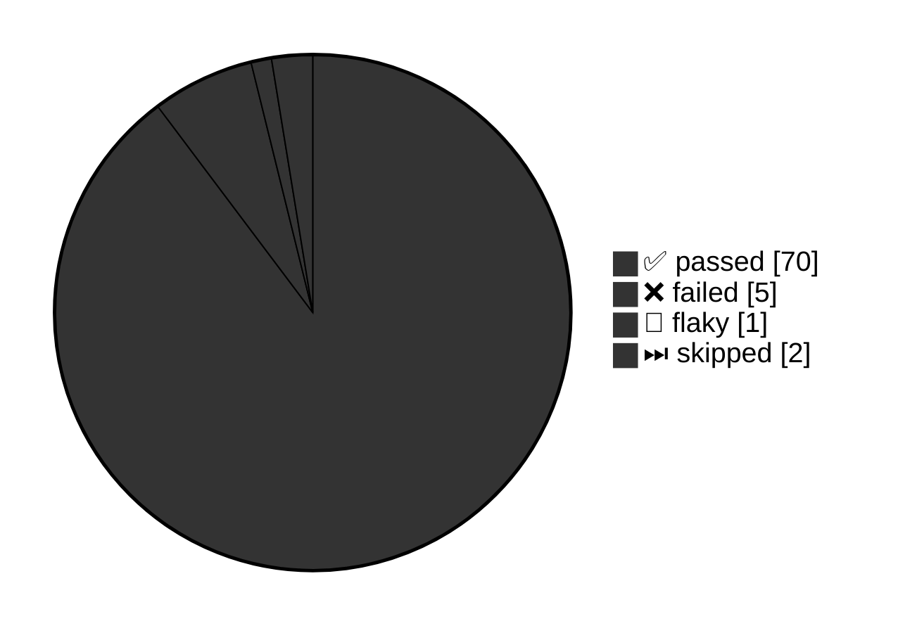

- ✅ 1 passed
- ❌ 2 failed
- ⏭ 0 skipped
- 🤞 0 flaky




### ❌ Failed tests

<details>
<summary>❌ [chromium] › failing.spec.js:4:1 › homepage has Playwright in title and get started link linking to the intro page</summary>


| ❌ First run |                                                                                   |
|-------------|-----------------------------------------------------------------------------------|
| Project     | `chromium`                                                                        |
| File        | `failing.spec.js:14:28`                                                           |
| Title       | `homepage has Playwright in title and get started link linking to the intro page` |
| Trace       | [trace.zip](https://google.com)                                                   |

#### Error
<pre>
expect(received).toHaveAttribute(expected)

Expected string: <strong>"/docs/intro"</strong>
Received string: <strong>""</strong>
Call log:
- expect.toHaveAttribute with timeout 5000ms
- waiting for selector "text=this doenst exist!"
</pre>

View trace:

```shell
npx playwright show-trace https://status.github.com/34567de7gcb5676faervtr/trace.zip
```

<details>
<summary>Retry ＃1</summary>

| 1️⃣ Retry ＃1 |                                                                                 |
|--------------|---------------------------------------------------------------------------------|
| Project      | chromium                                                                        |
| File         | failing.spec.js:14:28                                                           |
| Title        | homepage has Playwright in title and get started link linking to the intro page |
| Trace        | [trace.zip](https://google.com)                                                 |

View trace:

```shell
npx playwright show-trace https://status.github.com/34567de7gcb5676faervtr/trace.zip
```

</details>
</details>

---
